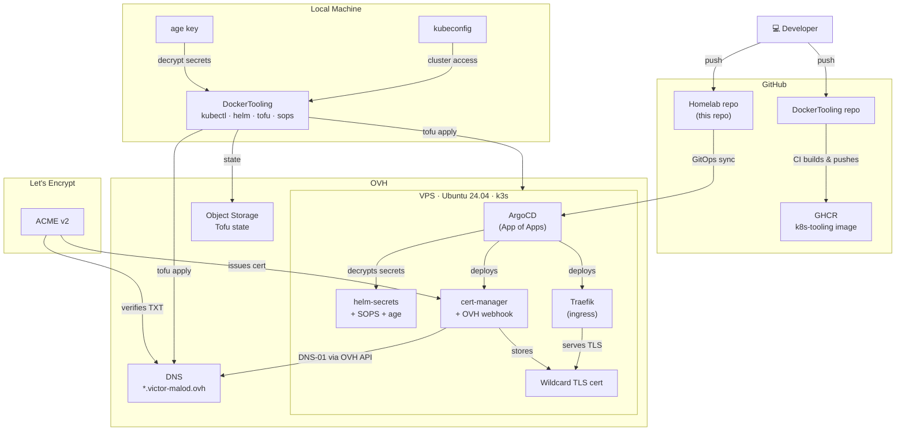

# Homelab

[](https://github.com/VictorMalodPortfolio/Homelab/actions/workflows/ci.yml)
[](https://k3s.io)
[](https://argo-cd.readthedocs.io)
[](https://opentofu.org)
[](https://letsencrypt.org)
[](https://github.com/VictorMalodPortfolio/Homelab/security/code-scanning)
[](https://github.com/renovatebot/renovate)
[](https://conventionalcommits.org)
[](LICENSE)

A personal lab where I experiment with cloud infrastructure in a dedicated environment I fully control through OVH — provisioned with OpenTofu, orchestrated with k3s, and managed end-to-end via GitOps.

## Architecture



## Repository structure

```
Homelab/
├── docker/               # Custom Docker images
│   └── argocd-repo-server/  # ArgoCD repo-server with helm-secrets, sops, age
├── terraform/            # OpenTofu — OVH VPS, DNS, k3s provisioning
├── argocd/               # ArgoCD Application manifests (App of Apps)
├── helm/                 # Helm charts and values per app
│   ├── argocd-config/    # ArgoCD server config (insecure mode, helm-secrets, IngressRoute)
│   ├── cert-manager/
│   ├── cert-manager-webhook-ovh/
│   ├── cluster-issuers/
│   ├── ovh-credentials/  # OVH API secret (SOPS-encrypted values)
│   └── traefik/
├── bootstrap/            # One-time bootstrap manifests and patches
└── BOOTSTRAP.md          # Step-by-step provisioning guide
```

## Getting started

See [BOOTSTRAP.md](BOOTSTRAP.md) for the full provisioning guide.

## Git hooks

Conventional commits are enforced locally via a `commit-msg` hook available in `.githooks/`. Run this once after cloning:

```bash
git config core.hooksPath .githooks
```
