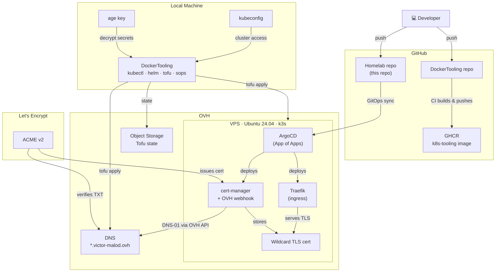

# Homelab

[](https://github.com/VictorMalodPortfolio/Homelab/actions/workflows/ci.yml)
[](https://github.com/VictorMalodPortfolio/Homelab/security/code-scanning)
[](LICENSE)

A personal lab where I experiment with cloud infrastructure in a dedicated environment I fully control through OVH — provisioned with OpenTofu, orchestrated with k3s, and managed end-to-end via GitOps.

## Architecture



## Repository structure

```
Homelab/
├── terraform/        # OpenTofu — OVH VPS, DNS, k3s provisioning
├── argocd/           # ArgoCD Application manifests (App of Apps)
├── helm/             # Helm values files per app
│   ├── cert-manager/
│   ├── cert-manager-webhook-ovh/
│   ├── cluster-issuers/
│   └── traefik/
├── bootstrap/        # One-time bootstrap manifests (root ArgoCD app)
└── BOOTSTRAP.md      # Step-by-step provisioning guide
```

## Getting started

See [BOOTSTRAP.md](BOOTSTRAP.md) for the full provisioning guide.

## Git hooks

Conventional commits are enforced locally via a `commit-msg` hook available in `.githooks/`. Run this once after cloning:

```bash
git config core.hooksPath .githooks
```
